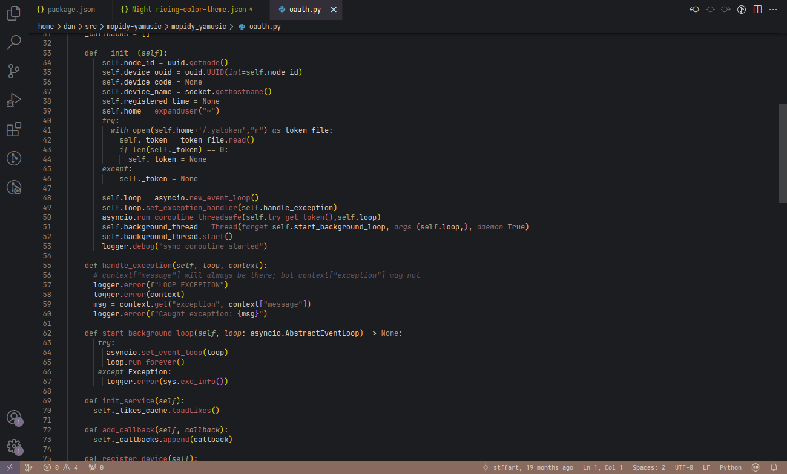

# Night rice 

Visual Studio Code theme

**Preview**

## Install

### From VS Code
1. Open the **Extensions** sidebar in VS Code
2. Search for `orw`
3. Click **Install** on `orw` by `obsqrbtz`
4. Press `ctrl + shift + p` (for macOS: `cmd + shift + p`) to open command palette
5. Search for `Preferences: Color Theme` and choose `orw` to apply the theme

### From VS Marketplace
1. Go to [Visual Studio Marketplace](https://marketplace.visualstudio.com/items?itemName=obsqrbtz.orw-colorscheme)
2. Click on the "Install" button
4. In VS Code press `ctrl + shift + p` (for macOS: `cmd + shift + p`) to open command palette
5. Search for `Preferences: Color Theme` and choose `orw` to apply the theme